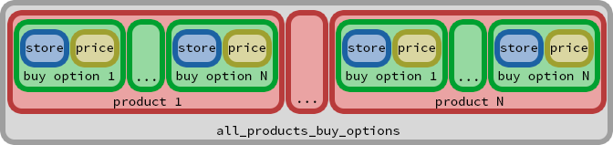

CUDA Marketplace
===================

Datos del proyecto
------------------

- Objetivo:
  - Iniciarnos en la programación con CUDA
- Descripción del proyecto:
  - En base a una serie de productos con múltiples opciones de compra, determinar cuál es la mejor opción de compra para cada uno de estos productos.
El criterio de "mejor opción de compra" únicamente se basa en el precio de ésta.
- Repositorio:
	- https://github.com/JavierCane/Cuda-Marketplace-Example
- Autores:
  - [Adrià Jorquera Codina](https://github.com/adriajorquera "GitHub Adrià")
  - [Javier Ferrer González](https://github.com/JavierCane "GitHub Javier")
- Asignatura:
  - [Tarjetas Gráficas y Aceleradores (TGA)](http://www.fib.upc.edu/es/estudiar-enginyeria-informatica/assignatures/TGA.html)
- Fecha de entrega:
  - 23 de junio de 2015
- Curso:
  - 2014-2015
- Facultad:
  - [Facultad de Informática de Barcelona (FIB)](http://www.fib.upc.edu/)
- Universidad:
  - [Universidad Politecnica de Cataluña (UPC)](http://www.upc.edu/)

----------

Introducción
-------------

### Dominio
Para este ejercicio hemos supuesto que somos los gestores de un portal de compras on-line que recientemente ha recibido un incremento notable en el volumen de peticiones a sus servidores. Debido a este incremento, el rendimiento de la plataforma se ha visto afectado y debemos optimizar algunas partes de la aplicación para poder seguir ofreciendo una navegación fluida por nuestra web.

Nuestro portal de ventas es de tipo Marketplace. Con lo cual, integramos los catálogos que recibimos por parte de las diversas tiendas afiliadas. Cabe destacar el hecho de que tenemos un gran porcentaje de solapamiento entre los catálogos de distintas tiendas, produciendo así que un mismo producto tenga múltiples opciones de compra, cada una con su precio asociado.

El usuario final es el que selecciona con qué afiliado quiere comprar cada uno de los productos. Es así cómo se configura su carrito de compra para poder realizar un pedido. Dado que el usuario no tiene por qué ser consciente de cómo funciona un Marketplace, puede darse el caso de que tenga productos en su carrito de compra con afiliados que no tienen la opción de compra más barata.

Debido a este tipo de escenarios, tenemos un proceso en nuestro sistema que se encarga de asegurarle al usuario que en todo momento tiene el mejor carrito de compra posible y, si no es así, le damos la opción de mejorarlo aplicando las opciones de compra más baratas.

Nos hemos dado cuenta de que, uno de los puntos que consume más recursos de los servidores, es el propio cálculo de esta mejor opción de compra teniendo en cuenta todos los productos del carrito. Con lo cuál, nos hemos decidido a migrar este pequeño algoritmo de C++ a CUDA con tal de comprobar si ganaríamos en tiempo y podríamos así mantener una carga menor en los servidores.

Por darle un poco de volumen y poder tener así un estudio de tiempos que no sean despreciables, hemos asumido que el número de productos que debemos manejar se mueven por el orden de 30.000 productos. Por otra parte, debido al solapamiento de catálogo que comentábamos antes, cada producto tiene alrededor de 1.000 opciones de compra.

Nota: Esta idea está inspirada en una [funcionalidad real (Smart Cart) llevada a cabo por el marketplace Uvinum](http://blog.uvinum.es/te-ayudamos-uvinum-ahorrar-tus-comprasr-atento-nuestros-consejos-2372700 "Descripción del Smart Cart de Uvinum"). Que a pesar de tener un contexto donde el rendimiento no es tan crítico, ni tendría sentido llevar a cabo esta optimización en CUDA, sí que nos pareció interesante intentar adoptar un matiz mínimamente realista para la práctica.

### Estructuras de datos
El input del programa se basa en el array inicializado en la función `initAllProductsBuyOptions`. Este array no es multidimensional. Es decir, todas las opciones de compra de todos los productos están colocadas una detrás de otra. Primero las opciones de compra del primer producto, luego las del segundo, y así hasta llegar a las opciones de compra de cada producto.

Cada opción de compra se basa en 2 enteros colocados también de forma consecutiva. Primeramente nos encontramos el identificador de la tienda afiliada que vende ese producto (accesible mediante la suma del `STORE_ID_OFFSET`) y después tenemos el precio del producto (accesible mediante la suma del `PRICE_OFFSET`) que, para el ejercicio hemos hecho que se generen de forma aleatoria.

En la siguiente ilustración se puede apreciar de forma más gráfica:


Solución secuencial en C++
-------------

### Datos
- Implementación:
  - [main.cpp](https://github.com/JavierCane/Cuda-Marketplace-Example/blob/master/main.cpp)
- Salida:
  - [main_cpp_output.txt](https://github.com/JavierCane/Cuda-Marketplace-Example/blob/master/main_cpp_output.txt)

### Descripción
El algoritmo al que nos enfrentamos es muy simple. No hemos querido cumentar su complejidad por intentar centrarnos en la parte correspondiente al paralelismo mediante CUDA y no al dominio en sí mismo.

Lo único que deberemos hacer será iterar por cada una de las posibles opciones de compra de cada uno de los productos y, en cada iteración, comprobar si la opción de compra es mejor que la guardada en un array de resultados temporal.

En el detalle de implementación que sigue se pueden ver los dos bucles que se usan para recorrer el array de productos. Uno exterior con la variable `product_iteration` como índice y que itera por cada producto, y uno interior con `product_to_compare` por índice que itera por todas las opciones de compra del producto actual.

### Detalle de implementación
```
    for(int product_iteration = 0; product_iteration < NUM_PRODUCTS; ++product_iteration)
    {
        for(int product_to_compare = ELEMENTS_PER_BUY_OPTION; product_to_compare < NUM_BUY_OPTIONS * ELEMENTS_PER_BUY_OPTION; product_to_compare += ELEMENTS_PER_BUY_OPTION)
        {
            // Si la opción de compra actual es mejor que la que tenemos guardada de forma temporal, la substituimos para guardárnosla como mejor opción de compra.
        }
    }
```

Primera versión del kernel en CUDA
-------------

### Datos
- Implementación:
  - [main.cu](https://github.com/JavierCane/Cuda-Marketplace-Example/blob/master/main.cu)
- Salida:
  - [main_cu_output.txt](https://github.com/JavierCane/Cuda-Marketplace-Example/blob/master/main_cu_output.txt)

### Descripción
En esta primera versión de la implementación del algoritmo en CUDA simplemente introducimos el concepto de paralelismo sin preocuparnos de la eficiencia.

Todo gira en torno al hecho de ejecutar una comparación por cada thread. Es decir, cada thread es responsable de saber si su opción de compra es mejor que la siguiente. Para el cálculo de la siguiente opción de compra se tiene en cuenta un stride que irá iterando en potencias de 2.

En el siguiente detalle de implementación se puede ver la esencia del kernel:

### Detalle de implementación
```
    tmp_best_buy_options[shared_thread_buy_option + STORE_ID_OFFSET] = total_buy_options[global_thread_buy_option + STORE_ID_OFFSET];
    tmp_best_buy_options[shared_thread_buy_option + PRICE_OFFSET] = total_buy_options[global_thread_buy_option + PRICE_OFFSET];
    __syncthreads();
    
    for (unsigned int stride = 2; stride <= blockDim.x; stride *= 2)
    {
        if (thread_id % stride == 0)
        {
            unsigned int next_buy_option_position = shared_thread_buy_option + stride;
            
	        // Si la opción de compra siguiente (teniendo en cuenta el stride) es mejor que la actual, la guardamos en el array de memoria compartida.
        }
        __syncthreads();
    }
```

Kernel CUDA con warps optimizados
-------------

### Datos
- Implementación:
  - [mainWarpsOptimized.cu](https://github.com/JavierCane/Cuda-Marketplace-Example/blob/master/mainWarpsOptimized.cu)
- Salida:
  - [mainWarpsOptimized_output.txt](https://github.com/JavierCane/Cuda-Marketplace-Example/blob/master/mainWarpsOptimized_output.txt)

### Descripción
En esta optimización, organizamos el trabajo que hace cada thread para tener un mejor acceso de memoria y un uso de Warps más eficiente. Anteriormente dentro de un bloque los threads trabajaban primero los pares, luego los múltiplos de cuatro, seguido de los múltiplos de 8 y así sucesivamente. Como los threads se lanzan en Warps, grupos de 32, se provocaba que los Warps se vaciaran enseguida y se lanzaban 32 threads de los cuales pocos hacian trabajo útil.

Para solucionar el problema, se organiza qué threads trabajan y sobre qué elementos. La manera de conseguirlo es haciendo que la carga de trabajo recaiga sobre threads consecutivos. Así se logra una mejor distribución del trabajo a realizar por los threads de cada Warp.

### Detalle de implementación
```
    tmp_best_buy_options[shared_thread_buy_option + STORE_ID_OFFSET] = total_buy_options[global_thread_buy_option + STORE_ID_OFFSET];
    tmp_best_buy_options[shared_thread_buy_option + PRICE_OFFSET] = total_buy_options[global_thread_buy_option + PRICE_OFFSET];
    __syncthreads();
    
    for (unsigned int stride = blockDim.x / 2; stride > 0; stride >>= 1)
    {
        if (thread_id < stride)
        {
            unsigned int next_buy_option_position = shared_thread_buy_option + stride * ELEMENTS_PER_BUY_OPTION;
            
	        // Si la opción de venta siguiente (teniendo en cuenta stride) es mejor que la actual, la guardamos en el array de memoria compartida.
        }
        __syncthreads();
    }
```

Kernel CUDA con más trabajo por thread
-------------

### Datos
- Implementación:
  - [mainWorkPerThreadOptimized.cu](https://github.com/JavierCane/Cuda-Marketplace-Example/blob/master/mainWorkPerThreadOptimized.cu)
- Salida:
  - [mainWorkPerThreadOptimized_output.txt](https://github.com/JavierCane/Cuda-Marketplace-Example/blob/master/mainWorkPerThreadOptimized_output.txt)

### Descripción
Tal como está organizado el programa, en la primera iteración del bucle de la reducción la mitad de los threads ya no hacen nada. Los threads con identificador mayor a BlockDim/2 lo único que hacen es traer un elemento desde memoria y ya está. Para aprovechar el paralelismo al màximo, se puede reducir el trabajo de los primeros threads para darselo a los otros.

La optimización realizada en esta situación se encuentra en hacer una comparación en cada thread antes de pasar al bucle de reducción. De esta manera, los threads traen dos elementos desde memoria y los comparan. Sólo el elemento con menor precio se guarda en la memoria compartida para iniciar la reducción.

Nota: Para hacer que el kernel funcione, se ha de reducir el número de threads por bloque a la mitad pues cada thread ahora trabaja con dos elementos.

### Detalle de implementación
```
    if (first_price < second_price)
    {
        tmp_best_buy_options[shared_thread_buy_option + STORE_ID_OFFSET] = first_store_id;
        tmp_best_buy_options[shared_thread_buy_option + PRICE_OFFSET] = first_price;
    }

    else
    {
        tmp_best_buy_options[shared_thread_buy_option + STORE_ID_OFFSET] = second_store_id;
        tmp_best_buy_options[shared_thread_buy_option + PRICE_OFFSET] = second_price;
    }

    __syncthreads();
    
	// Bucle idéntico a la optimización anterior
```

Conclusiones
-------------
### Rendimiento

Datos de la prueba:

- Número de opciones de compra por cada producto: 1024
- Número de productos (bloques del kernel): 30000
- Número de hilos por cada bloque: 1024
- Tamaño total del vector con todos los productos y todas las opciones de compra: 30720000

| Implementación     	| Tiempo total (en milisegs.) | Ancho de banda (en GB/s) |
|:----------------------|----------:|------------:|
| Secuencial en C++		| 38.636768 |-------------|
| Kernel CUDA			| 12.416704	| 19.793 GB/s |
| Warps optimizados		| 8.137472	| 30.201 GB/s |
| Más trabajo por thread| 4.697472	| 52.318 GB/s |
